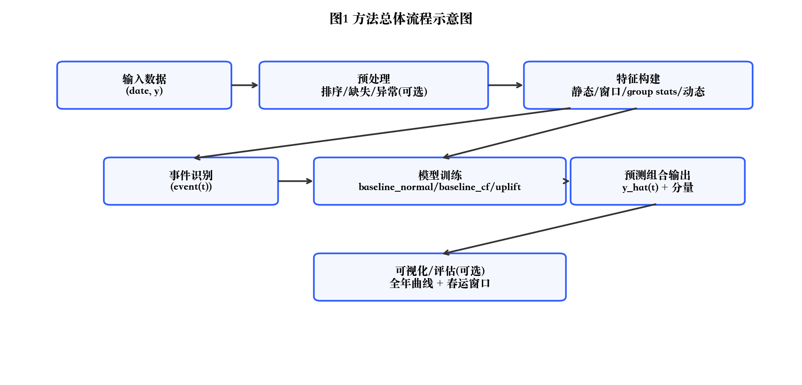
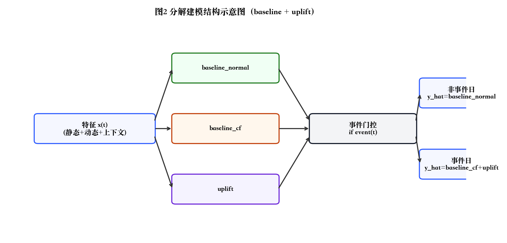
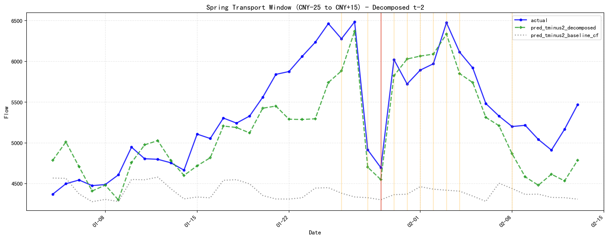

# 发明名称
一种基于分解建模的节假日感知交通流量预测方法

# 摘要
本发明公开了一种基于分解建模的节假日感知交通流量预测方法，面向按天采样的全国交通流量单序列预测场景。本发明以节假日/调休日历与春节日期表为先验输入，构建静态日历特征、节假日与春节窗口上下文特征、训练期统计映射特征以及动态滞后/滚动/趋势特征，形成特征向量；进一步提出“常态基线 + 事件增量”的分解建模框架，并在一个实施例中采用梯度提升决策树回归模型进行训练：训练常态基线模型拟合全量日常水平；训练反事实基线模型仅在非节假日且非春运窗口样本上拟合无事件影响的基线；以真实值与反事实基线预测值之差作为残差标签，在节假日/春运窗口样本上训练增量模型预测事件增量。预测阶段根据样本是否属于事件日选择基线并叠加对应增量，输出预测值及反事实基线与增量分量，以增强可解释性。本发明能够提升节假日及春运窗口期间的预测精度与可解释性，特别适用于峰值稀疏、分布漂移明显且需可追溯解释的交通流量预测应用。

# 权利要求书
1. 一种基于分解建模的节假日感知交通流量预测方法，其特征在于，包括如下步骤：  
S1 获取按天采样的交通流量序列数据并按日期排序；  
S2 基于日期构建静态日历与节假日上下文特征；  
S3 基于预设春节日期表构建春节窗口相对日特征；  
S4 仅使用训练期真实值在类别变量上计算统计映射并映射回样本，得到训练期统计映射特征；  
S5 构建动态时序特征；  
S6 根据静态特征识别事件日并生成事件指示变量；  
S7 在训练集全量样本上训练常态基线模型得到 baseline_normal(t)；  
S8 在训练集中仅使用非事件日样本训练反事实基线模型得到 baseline_cf(t)；  
S9 在训练集事件日样本上以 residual(t)=y(t)-baseline_cf(t) 为标签训练事件增量模型得到 uplift(t)，并将 baseline_normal(t) 与 baseline_cf(t) 作为增量模型的辅助输入特征；  
S10 对预测期样本，非事件日输出 y_hat(t)=baseline_normal(t)，事件日输出 y_hat(t)=baseline_cf(t)+uplift(t)，并输出至少包括 baseline_cf(t) 与 uplift(t) 的分解结果。

2. 根据权利要求1所述的方法，其特征在于，所述静态日历与节假日上下文特征至少包括：周末标识、法定节假日标识、调休工作日标识、节假日类型、距离上一/下一节假日天数、节假日阶段与进度特征中的一种或多种。

3. 根据权利要求1所述的方法，其特征在于，所述春节窗口相对日特征至少包括：days_to_cny、春节窗口标识、节前天数编码、节后天数编码、春节当日标识中的一种或多种。

4. 根据权利要求1所述的方法，其特征在于，所述训练期统计映射特征至少包括：按星期、月份、节假日类型及春节相对日统计得到的均值与标准差映射中的一种或多种。

5. 根据权利要求1所述的方法，其特征在于，所述动态时序特征至少包括：多阶滞后项、滚动均值、滚动标准差、趋势项、线性斜率、趋势加速度、偏离度特征中的一种或多种。

6. 根据权利要求1所述的方法，其特征在于，所述事件日包括法定节假日与春运窗口日中的一种或多种。

7. 根据权利要求1所述的方法，其特征在于，所述事件增量模型按事件类型拆分为春节窗口增量模型与非春节法定节假日增量模型，并在预测期按事件类型选择对应增量模型输出 uplift(t)。

8. 根据权利要求1所述的方法，其特征在于，所述常态基线模型、反事实基线模型与事件增量模型均为梯度提升决策树回归模型。

# 说明书
## 技术领域
本发明属于交通流量预测与时间序列预测技术领域，具体涉及一种基于节假日特征工程与分解建模（baseline + uplift）的交通流量预测方法。

## 背景技术
交通流量预测常具有显著的周期性（周内、年内）、节假日制度驱动的结构突变以及春节等关键窗口的强非平稳峰形。传统单模型方案在全量样本上统一拟合，往往在“常态日占多数、峰值日占少数”的分布下倾向于对峰值与突变保守，表现为节假日或春运窗口系统性偏低估。
因此，亟需一种同时满足：①对节假日/春运窗口的增量效应进行结构化建模；②输出具有可解释分解的预测结果；③在小样本年份数据条件下仍保持稳定泛化能力的预测方法。

## 发明内容
### 要解决的技术问题
本发明要解决的技术问题至少包括：
1) 提升节假日与春运窗口等峰值稀疏场景的预测精度，降低系统性低估；
2) 提供“常态水平/反事实基线/事件增量”的可解释输出，便于业务分析与归因；
3) 在数据年份较少的条件下保持稳定泛化能力。

### 技术方案
为解决上述问题，本发明提供如下技术方案。

#### 一种基于分解建模的节假日感知交通流量预测方法
为便于说明，先对本文符号作统一定义。

**符号与变量定义**  
- `t`：时间索引（按天），对应日期 `date(t)`；  
- `y(t)`：第 `t` 天的交通流量真实值（训练/评估时可获得）；  
- `y_hat(t)`：第 `t` 天的交通流量预测值；  
- `event(t)`：事件指示变量，`event(t)∈{0,1}`，其中 `1` 表示节假日或春运窗口日；  
- `x(t)`：第 `t` 天用于预测的特征向量；  
- `x_static(t)`：静态日历特征（年/月/日、星期、年内日序、周期性编码等）；  
- `x_ctx(t)`：节假日/春节窗口上下文特征（节假日类型、阶段、days_to_cny、窗口进度等）；  
- `x_stats(t)`：训练期统计映射特征（group stats 映射后的均值/标准差等）；  
- `x_dyn(t)`：动态时序特征（滞后、滚动统计、趋势等）；  
- `f_n(·)`：常态基线模型（baseline_normal）；  
- `f_cf(·)`：反事实基线模型（baseline_cf）；  
- `g(·)`：事件增量模型（uplift）；  
- `r(t)`：残差标签（事件增量学习目标）。

**输入与输出**  
- 输入：按天采样的交通流量序列 `{(date(t), y(t))}`（训练期提供 `y(t)`），节假日与调休日历表 `cal(date)`（含节假日类型、调休等），春节日期表 `cny_date(year)`；  
- 输出：对预测期内每一天输出预测值 `y_hat(t)`，并输出分解分量 `baseline_cf(t)=f_cf(x(t))` 与 `uplift(t)=g(z(t))`（事件日）以用于解释；同时输出 `event(t)` 用于标注节假日/春运窗口。

**(1) 训练期统计映射（group stats）**  
以任一类别分组变量 `c(t)`（例如星期、月份、节假日类型、春节相对日等）为例，训练期内该组别 `u` 的均值与标准差定义为：
\[
\mu_u = \frac{1}{|\\mathcal{T}_u|}\sum_{t\in\\mathcal{T}_u} y(t),\\quad
\sigma_u = \sqrt{\\frac{1}{|\\mathcal{T}_u|}\sum_{t\in\\mathcal{T}_u} (y(t)-\mu_u)^2}
\tag{1}
\]
其中，`\\mathcal{T}_u = { t | t 属于训练期 且 c(t)=u }`。将 `(\\mu_u,\\sigma_u)` 映射回每个样本形成 `x_stats(t)`。

**(2) 特征向量拼接**  
将不同来源的特征拼接为：
\[
x(t) = [x_{static}(t), x_{ctx}(t), x_{stats}(t), x_{dyn}(t)]
\tag{2}
\]

**(3) 动态时序特征（示例）**  
以滞后与滚动均值为例：
\[
\\text{lag}_\\ell(t)=y(t-\\ell),\\quad
\\text{rollmean}_w(t)=\\frac{1}{w}\sum_{i=1}^{w} y(t-i)
\tag{3}
\]
其中 `\\ell` 为滞后阶数，`w` 为窗口长度；趋势/斜率等可由一段历史窗口的线性拟合或差分构造，统一记入 `x_dyn(t)`。

滚动标准差为：
\[
\\text{rollstd}_w(t)=\\sqrt{\\frac{1}{w}\sum_{i=1}^{w} (y(t-i)-\\text{rollmean}_w(t))^2}
\tag{4}
\]

一阶差分与“加速度”（二阶差分）可表示为：
\[
\\Delta y(t)=y(t-1)-y(t-2),\\quad
\\Delta^2 y(t)=\\Delta y(t)-\\Delta y(t-1)
\tag{5}
\]

趋势斜率（示例）可由最近 `w` 天窗口内的线性回归得到：
\[
\\text{slope}_w(t) = \\frac{\\sum_{i=1}^{w}(i-\\bar{i})(y(t-i)-\\overline{y})}{\\sum_{i=1}^{w}(i-\\bar{i})^2}
\tag{6}
\]
其中 `\\bar{i}=(w+1)/2`，`\\overline{y}=(1/w)\sum_{i=1}^{w}y(t-i)`。

静态日历中的周期性编码（以年内日序 `doy(t)` 为例）可表示为：
\[
\\text{sin\_doy}(t)=\\sin\\left(2\\pi\\frac{doy(t)}{365}\\right),\\quad
\\text{cos\_doy}(t)=\\cos\\left(2\\pi\\frac{doy(t)}{365}\\right)
\tag{7}
\]

春节相对日特征定义为：
\[
days\\_to\\_cny(t) = date(t) - cny\\_date(year(t))
\tag{8}
\]
其中 `date(t)` 与 `cny_date(year(t))` 均以“天”为单位可比较（例如转为整数日序）。

春运窗口标识（实施例）可由春节相对日阈值定义，例如：
\[
spring\\_window(t)=\\mathbf{1}\\{-25\\le days\\_to\\_cny(t)\\le 15\\}
\tag{9}
\]
其中 `\\mathbf{1}{·}` 为指示函数。

事件日判定（实施例）可由“法定节假日/春运窗口”联合定义：
\[
event(t)=\\mathbf{1}\\{holiday(t)=1\\ \\text{or}\\ spring\\_window(t)=1\\}
\tag{10}
\]
其中 `holiday(t)` 由日历表 `cal(date(t))` 给出（例如法定节假日标识）。

节假日上下文特征（实施例）还可包括距离上一/下一节假日的天数：
\[
days\\_since\\_holiday(t)=t-\\max\\{\\tau\\le t\\mid holiday(\\tau)=1\\},\\quad
days\\_to\\_holiday(t)=\\min\\{\\tau\\ge t\\mid holiday(\\tau)=1\\}-t
\tag{11}
\]

**模型形式说明（梯度提升决策树回归，GBDT）**  
所述 `f_n(·)`、`f_cf(·)`、`g(·)` 在一个实施例中均采用梯度提升决策树回归模型，其函数形式为：
\[
F(x)=\\sum_{m=1}^{M} \\eta\\,h_m(x)
\tag{12}
\]
其中 `h_m(·)` 为第 `m` 棵回归树，`M` 为树的数量，`\\eta` 为学习率；可采用 XGBoost、LightGBM 等实现。

**(4) 分解建模的监督信号与组合规则**  
常态基线与反事实基线分别以平方损失（或等价回归损失）进行训练：
\[
\\min_{f_n}\\sum_{t\in\\mathcal{T}} (y(t)-f_n(x(t)))^2,
\\quad
\\min_{f_{cf}}\\sum_{t\in\\mathcal{T}_{\\neg event}} (y(t)-f_{cf}(x(t)))^2
\tag{13}
\]
其中 `\\mathcal{T}` 为训练期样本集合，`\\mathcal{T}_{\\neg event}={t\\in\\mathcal{T}\\mid event(t)=0}`。

事件增量以残差作为标签：
\[
r(t)=y(t)-f_{cf}(x(t)),\\quad t\\in\\mathcal{T}_{event}
\tag{14}
\]
其中 `\\mathcal{T}_{event}={t\\in\\mathcal{T}\\mid event(t)=1}`。事件增量模型训练为：
\[
\\min_{g}\\sum_{t\in\\mathcal{T}_{event}} (r(t)-g(z(t)))^2
\tag{15}
\]
其中 `z(t)` 为增量模型输入特征向量，可由 `x_ctx(t)`、`x_stats(t)` 及辅助输入 `f_n(x(t))`、`f_{cf}(x(t))` 拼接得到。

预测组合输出规则为：
\[
\\hat{y}(t)=
\\begin{cases}
f_n(x(t)), & event(t)=0 \\\\
f_{cf}(x(t)) + g(z(t)), & event(t)=1
\\end{cases}
\tag{16}
\]
并可同时输出分量 `f_{cf}(x(t))` 与 `g(z(t))` 用于解释“反事实基线/事件增量”贡献。

在上述统一定义与公式基础上，该方法包括如下步骤：

**S1：数据输入与预处理**  
获取按天采样的交通流量序列数据，至少包括日期字段 `date` 与目标字段 `y`；对日期字段进行解析与排序，形成按时间有序的样本集合。

**S2：静态日历与节假日上下文特征构建**  
基于日期生成静态特征，包括但不限于：年/月/日、星期、年内日序、周末标识；并对周期性特征进行正余弦编码（例如式(7)）。基于日历表 `cal(date(t))` 生成节假日上下文特征，包括法定节假日标识、调休工作日标识、节假日类型、节假日阶段与进度、距离上一/下一节假日的天数（例如式(11)）等。

**S3：春节窗口相对日特征构建**  
基于预设的春节日期表，为每个样本构建春节相对日特征 `days_to_cny(t)`（例如式(8)）及窗口派生特征（例如春运窗口标识 `spring_window(t)`，式(9)），并可进一步构建节前/节后天数编码与春节当日标识等。

**S4：训练期统计映射特征（group stats）构建**  
仅使用训练期样本的真实值 y，在类别变量上计算统计映射并映射回全量样本，所述类别变量包括但不限于：星期、月份、节假日类型、春节相对日（窗口内）；统计量包括但不限于均值与标准差，用以为模型提供稳定先验并提升小样本泛化。

**S5：动态时序特征构建**  
构建动态时序特征，动态特征包括但不限于：多阶滞后项与滚动均值（式(3)）、滚动标准差（式(4)）、差分与二阶差分（式(5)）、趋势斜率（式(6)）以及偏离度等；所述动态特征均由历史观测值计算得到。

**S6：事件日识别（uplift mask）**  
根据静态特征判定事件日集合，事件日至少包括：法定节假日、春运窗口日；生成事件指示变量 `event(t)`（例如式(10)）。

**S7：训练常态基线模型（baseline_normal）**  
在训练集全量样本上，使用包含静态特征与动态特征的特征子集训练基线模型，以最小化预设损失函数，输出常态基线预测 `baseline_normal(t)`。

**S8：训练反事实基线模型（baseline_cf）**  
在训练集中仅使用非事件日样本训练反事实基线模型，得到“若无事件影响”的基线预测 `baseline_cf(t)`。

**S9：训练事件增量模型（uplift）**  
以训练集事件日样本为训练对象，构造残差标签：`residual(t) = y(t) - baseline_cf(t)`；使用节假日/春节窗口上下文特征作为主要输入，并将 `baseline_normal(t)` 与 `baseline_cf(t)` 作为辅助输入特征，训练增量模型预测 `uplift(t)`；所述增量模型可进一步按事件类型拆分为春节窗口增量模型与非春节法定节假日增量模型。

**S10：预测组合与输出**  
对目标预测期样本，若为非事件日，则输出 `y_hat(t)=baseline_normal(t)`；若为事件日，则输出 `y_hat(t)=baseline_cf(t)+uplift(t)`；同时输出至少包括 `baseline_cf(t)` 与 `uplift(t)` 以供解释分析，得到最终预测结果序列。

### 有益效果
与现有技术相比，本发明至少具有如下有益效果：
1) **降低节假日/春运低估**：将常态与事件增量分开学习，缓解峰值稀疏导致的“常态更准、峰值吃亏”折中；
2) **可解释输出**：同时提供反事实基线与增量项，支持对事件影响的解释、对比与归因；
3) **小样本友好**：利用 group stats 先验与结构化分解，提升在仅少量年份数据下的稳定性。

## 附图说明
图1 为本发明方法的总体流程示意图；  
图2 为本发明分解建模的结构示意图（baseline_normal / baseline_cf / uplift / 组合输出）；  
图3 为本发明在春运窗口的预测对比曲线示意图（真实值、反事实基线、分解预测）；  
图4 为本发明在全年范围的预测对比曲线示意图（真实值、反事实基线、分解预测）。

## 附图
### 图1 方法总体流程示意图

### 图2 分解建模结构示意图（baseline + uplift）

### 图3 春运窗口预测对比曲线示意图

### 图4 全年预测对比曲线示意图

## 具体实施方式
以下结合实施例对本发明进行说明，但本发明的保护范围不限于此。

## 实施例一：分解建模预测（baseline + uplift）
本实施例以“全国日度交通流量单序列”为对象说明本发明的训练与预测过程。

**(1) 数据准备与样本划分**  
1) 输入日频全国交通流量数据，包含 `date` 与 `y` 两列；并输入节假日/调休日历表 `cal(date)` 与春节日期表 `cny_date(year)`。  
2) 以时间顺序划分训练期与预测期（例如以连续历史年份作为训练期、未来年份作为预测期），训练期仅用于模型训练与统计映射计算。  

**(2) 特征构建**  
3) 静态特征：由日期派生工作日/周末/节假日、距离/阶段等上下文特征；构建春节相对日坐标特征 `days_to_cny` 及窗口派生特征。  
4) 统计映射特征（group stats）：仅用训练期样本统计星期/月/节假日类型/春节相对日的均值与标准差，并映射到全量样本以形成稳定先验。  
5) 动态时序特征：由历史观测构造 `lag/roll/std/trend/slope/accel` 等特征，用于表达短期惯性、波动与趋势变化。  

**(3) 模型训练（示例为梯度提升决策树类模型）**  
6) 模型选择：在本实施例中，常态基线模型、反事实基线模型与事件增量模型均采用梯度提升决策树回归模型（例如 XGBoost/LightGBM），以平方损失为目标函数（参见式(13)~式(16)）。  
7) 训练 baseline_normal：在训练期全量样本上拟合 `y(t)`，得到 `baseline_normal(t)=f_n(x(t))`。  
8) 训练 baseline_cf：在训练期非事件日样本上拟合 `y(t)`，得到 `baseline_cf(t)=f_cf(x(t))`。  
9) 训练 uplift：在训练期事件日样本上拟合残差 `r(t)=y(t)-baseline_cf(t)`，并将 `baseline_normal(t)`、`baseline_cf(t)` 作为辅助输入特征以增强对当前水平的感知，得到 `uplift(t)=g(z(t))`。  

**(4) 预测与输出**  
10) 对预测期每一天生成 `event(t)`：若为事件日则输出 `y_hat(t)=baseline_cf(t)+uplift(t)`，否则输出 `y_hat(t)=baseline_normal(t)`。  
11) 输出：除 `y_hat(t)` 外，至少包含 `baseline_cf(t)` 与 `uplift(t)` 的分量序列，用于解释节假日/春运窗口的增量贡献；可按图3所示在春运窗口内进行对比展示，并按图4展示全年对比曲线。

## 实施例二：事件类型拆分的增量模型
在实施例一的基础上，将事件日分为春节窗口事件与非春节法定节假日事件，分别训练 `uplift_cny` 与 `uplift_holiday`，预测时按事件类型选择对应的增量模型，以提高对不同事件机制的拟合能力。
